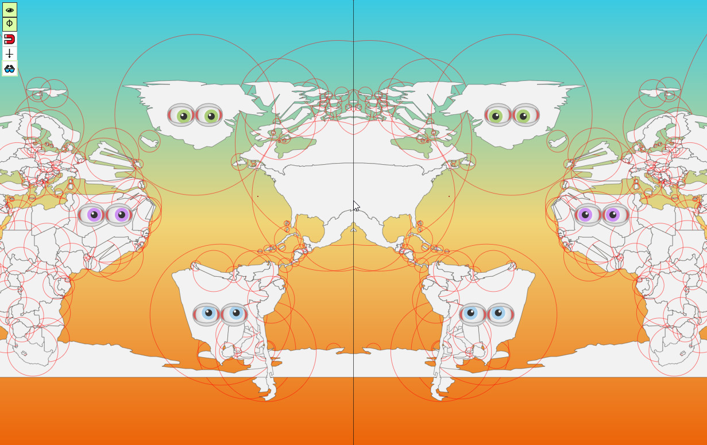

# Useless Map Library

A useless map library



## Example

```html
<!DOCTYPE html>
<html lang="en">
<head>
    <meta charset="utf-8" />
    <meta name="viewport" content="width=device-width, initial-scale=1" />
    <meta name="description" content="A useless map library" />
    <title>Useless Map</title>
    <link rel="stylesheet" href="useless-map.css">
    <script src="useless-map.js"></script>
    <script src="useless-tools/eyes.js"></script>
    <script src="useless-tools/mirror.js"></script>
    <script src="useless-tools/magnet.js"></script>
    <script src="useless-tools/gravity.js"></script>
    <script src="useless-tools/blur.js"></script>
    <style>
        body,
        html {
            position: absolute;
            width: 100%;
            height: 100%;
            margin: 0;
            padding: 0;
            display: flex;
            align-items: center;
            justify-content: center;
        }
        #container {
            width: 80%;
            height: 80%;
            background-color: #f2f2f2;
        }
    </style>
</head>

<body>
    <div id="container"></div>
    <script>
        fetch('data/countries.geo.json')
            .then(res => res.json())
            .then((data) => {
                const map = UselessMap.setup({
                    target: '#container',
                    background: {
                        colors: ['#39cae3', '#f0d577', '#ec6308'],
                        direction: 'vertical'
                    },
                    zoom: 2,
                    center: [0, 0],
                    debug: false,
                    style: [{
                        layer: 'countries',
                        fill: '#f2f2f2',
                        stroke: '#444444',
                        strokeWidth: 0.5
                    }],
                    layers: [
                        {
                            type: 'geojson',
                            id: 'countries',
                            data: data
                        }
                    ]
                });
                map.addTool(UselessMap.eyes());
                map.addTool(UselessMap.mirror());
                map.addTool(UselessMap.magnet());
                map.addTool(UselessMap.gravity());
                map.addTool(UselessMap.blur());
            });

    </script>
</body>

</html>
```

## Useless Tools

| icon | name | description |
| --- | --- | --- |
| 👁 | `eye` | double click event adds a pair of eyes to a selected polygon |
| ⏀ | `mirror` | mirror effect on map |
| 🧲 | `magnet` | attracts geometry coordinates to the mouse position |
| ⍖ | `gravity` | attracts geometries in view to the bottom |
| 👓 | `blur` | makes the map randomly blurred |

## Sample Data

country.geo.json data from https://github.com/johan/world.geo.json
